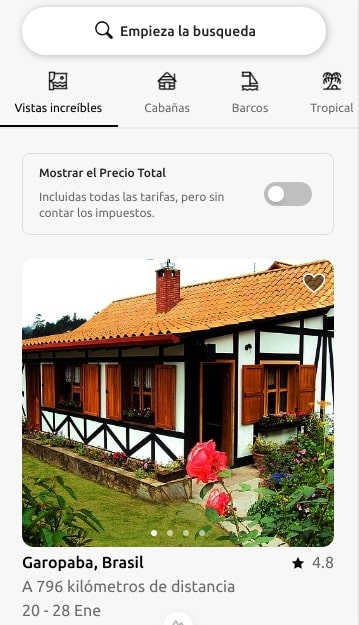

# Airbnb Home Page Clone

Este es un clon de la página principal de Airbnb creado únicamente con fines educativos.  
**Este proyecto no tiene relación alguna con Airbnb y no será utilizado para ningún propósito fraudulento ni comercial.**

## Propósito del proyecto
- Practicar habilidades de desarrollo frontend y diseño web.
- Aprender técnicas de diseño moderno utilizando [Vue.js, Nuxt, TailwindCSS, Pinia].

## Disclaimer
Este proyecto es solo para fines de aprendizaje. Todos los derechos y activos relacionados con Airbnb son propiedad de sus respectivos dueños.  

## Tecnologías utilizadas
- [Vue 3, Composition API, Nuxt 3, Pinia, TailwindCSS]

[Ver la aplicación](https://airbnb-clone-khaki-eta.vercel.app/)

## Cómo funciona?

Requiere Node.JS 20.12.2

* `yarn` para instalar las dependencias.
* `yarn dev` para el entorno de desarrollo.
* `yarn build` para el entorno de producción.

## Licencia 

MIT
